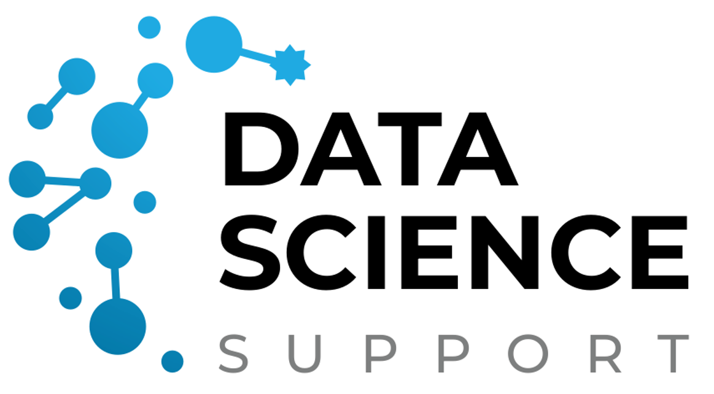

# DSS Environment Analysis

<p align="center">
  
</p>

Tools for extracting, analyzing, and comparing environmental data from multiple sources.

> Developed by the Data Science Support group (DSS) at AWI  
> For the HealthyPlanet Project – BIPS, under the DataNord initiative

---

This repository is under active development.

## 🚀 Getting Started

### Prerequisites

Before you begin, ensure you have the following installed on your system:
- [Docker](https://docs.docker.com/get-docker/)
- [Visual Studio Code](https://code.visualstudio.com/)
- [Dev Containers extension](https://marketplace.visualstudio.com/items?itemName=ms-vscode-remote.remote-containers) for VS Code

### Setup Instructions

Follow these step-by-step instructions to clone and set up the repository:

#### 1. Clone the Repository

```bash
git clone https://github.com/MuhammadShafeeque/dss-environment-analysis.git
cd dss-environment-analysis
```

#### 2. Open in Dev Container

1. **Using VS Code Command Palette:**
   - Open VS Code
   - Press `Ctrl+Shift+P` (or `Cmd+Shift+P` on macOS)
   - Type "Dev Containers: Open Folder in Container"
   - Select the cloned repository folder

2. **Alternative: Using VS Code directly:**
   ```bash
   code .
   ```
   - VS Code will detect the `.devcontainer` configuration
   - Click "Reopen in Container" when prompted

#### 3. Wait for Container Setup

The dev container will automatically:
- Build the custom Docker image based on the Dockerfile
- Install Python 3.13+ and required system dependencies
- Set up the Python virtual environment using `uv`
- Install project dependencies with `uv pip install -e .[dev]`
- Configure VS Code extensions (Python, Pylance, GitHub Copilot, Ruff)

This process may take a few minutes on the first run.

#### 4. Verify Installation

Once the container is ready, you can verify the setup:

```bash
# Check Python version
python --version

# Check that the package is installed in development mode
pip list | grep elapse-compare

# Run tests to ensure everything is working
pytest
```

### Development Environment

The dev container includes:
- **Python 3.13+** with `uv` package manager
- **Pre-configured VS Code extensions:**
  - Python support with IntelliSense
  - Pylance for enhanced Python language support
  - GitHub Copilot for AI-powered code assistance
  - Ruff for fast Python linting and formatting
- **Development dependencies:**
  - pytest for testing
  - mypy for type checking
  - ruff for code formatting and linting

### Project Structure

```
dss-environment-analysis/
├── .devcontainer/          # Dev container configuration
├── src/                    # Source code
│   ├── elapse_compare/     # Main package
│   └── pollution_extraction/
├── tests/                  # Test files
├── docs/                   # Documentation
├── pyproject.toml          # Project configuration
├── uv.lock                 # Dependency lock file
└── README.md              # This file
```

---

**Note:** Usage instructions will be updated after the current development phase is complete.
